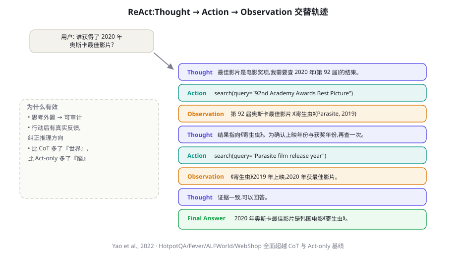

# AI Agent Cookbook · 写作规范（STYLE GUIDE）

> 本文件是全书唯一的写作标准。所有章节作者（人类或 AI）写前必读，写后必须通过 `tools/check_chapter.py` 校验。

## 0. 一句话定位

一本**中文为主、术语双语**的 LLM Agent 全景 Cookbook：入门可读、工程师可抄、研究者可查。
读者是**聪明的成年人**：不哄、不装、不注水。每个概念给出「是什么 → 为什么 → 怎么做 → 常见坑 → 去哪深读」。

## 1. 文件与结构规范

- 每章一个独立 HTML 文件：`chapters/chXXX.html`（三位数编号，如 `ch016.html`）。
- 章节必须从 `tools/toc.json` 获取标题与编号，不得擅自改名（副标题可加在 lead 中）。
- 页面骨架严格参照 `docs/chapter-template.html`：
  - `<head>` 引入 `../assets/css/style.css` 与 `../assets/js/app.js`（**相对路径必须带 `../`**）。
  - 面包屑：`首页 / 部分名 / 第 N 章`。
  - `.chapter-header`：h1 标题、`.lead` 一段话导语（80~140 字，说清本章解决什么问题）、`.chapter-meta`（级别徽章 + 标签徽章 + 预计阅读时间）。
  - 正文：**5~10 个 `<h2>` 小节**，每个 h2 必须有 ASCII `id`（如 `id="react-loop"`），用于右侧页内目录。
  - 章末三件套：`本章小结`（要点列表）、`自测题`（3~5 题，含简答提示）、`参考文献与延伸阅读`（`.refs` 区块）。
  - 底部 `.chapter-nav` 上一章/下一章（按 toc.json 顺序）。

## 2. 内容质量标准（每章硬指标）

| 指标 | 要求 |
|---|---|
| 正文字数 | ≥ 6000 汉字（不含代码），HTML 文件体积 ≥ 30KB（附录减半：≥3000 字 / 20KB） |
| 小节 | 5~10 个 h2；每节 800~1500 字或等效代码/表格 |
| 图 | ≥ 1 张（复用 `assets/figures/` 或新画，见 §4） |
| 表格 | ≥ 1 张对比/参数/选型表（适用章节） |
| 代码 | ≥ 1 段可运行的核心代码（工程/实战章 ≥ 3 段） |
| 引用 | ≥ 4 条真实文献/资源（作者、年份、标题、venue/arXiv 号必须真实可查） |
| 交叉链接 | ≥ 2 处站内链接到相关章节 `<a href="chXXX.html">` |

**严禁**：占位文本、编造的论文/数据/链接、"详见后续版本"、空洞的排比句、AI 腔（"总而言之""综上所述"每章至多 1 次）。

## 3. 语言与风格

- 简体中文；术语首次出现用「中文（English）」格式，如「检索增强生成（Retrieval-Augmented Generation, RAG）」，此后可只用中文或缩写。
- 句子短、结论先行。允许有观点的判断（"大多数场景不需要多 Agent"），但必须给出理由或证据。
- 技术准确率优先：不确定的数字写「量级」而非伪精确（"约 2~3 倍" 而非 "2.17 倍"，除非有出处）。
- 人称：用「你」称呼读者；用「我们」描述本书的操作。避免「笔者」「大家」。
- 数字与单位：Token、参数量用 B/M/K（7B、175B）；金额用美元；日期用 2024-11。
- 翻译约定：Agent=智能体（正文可用 Agent）；Grounding=接地/落地；Hallucination=幻觉；Alignment=对齐；保留 ReAct、RAG、RLHF、MCP、SFT 等缩写不译。

## 4. 插图规范

1. 优先复用已有图：清单见 `assets/figures/`（文件名即主题）。
2. 需要新图时：写脚本 `tools/figures_chXXX.py`，`from figkit import *`，参考 `figures_a.py` 的写法；运行后 SVG 输出到 `assets/figures/`。**禁止**手写复杂 SVG、禁止外部图片热链。
3. HTML 中引用：
```html
<figure class="figure">
  
  <figcaption><span class="fig-no">图 16-1</span>ReAct 的 Thought–Action–Observation 轨迹（Yao et al., 2022）。</figcaption>
</figure>
```
4. 图号 = `图 章号-章内序号`；每张图必须有 caption，caption 要能独立读懂。
5. 每章新增图 1~3 张为宜；图内文字必须是中文（术语可英文）。

## 5. 代码块规范

```html
<div class="codeblock">
  <div class="cb-head"><span class="dots"><i></i><i></i><i></i></span>
    <span class="lang">python</span><span class="cb-title">最小 ReAct 循环</span>
    <button class="copy">复制</button></div>
  <pre><code>...</code></pre>
</div>
```
- 语言标签小写：python / typescript / bash / json / yaml。
- 关键行加中文注释；代码要能独立运行（依赖写清楚）；长度 10~60 行，超过就拆分讲解。
- HTML 转义：代码中的 `<`、`>`、`&` 必须转义为 `&lt;` `&gt;` `&amp;`。

## 6. 组件用法

- 提示块：
  - `<div class="callout tip"><div class="co-title">💡 实践建议</div>…</div>`
  - `note`（📘 补充说明）、`warn`（⚠️ 常见坑）、`danger`（🚨 安全警告）、`deep`（🔬 深入细节）、`paper`（📄 论文速览：co-title 下加 `<div class="co-meta">作者 · 年份 · venue</div>`）。
- 行内代码 `<code>`；键位 `<kbd>`；不要用 h3 以下标题做列表。
- 表格必须包在 `<div class="tbl-wrap">` 中。

## 7. 引用格式

```
Yao, S. et al. (2022). ReAct: Synergizing Reasoning and Acting in Language Models. ICLR 2023. arXiv:2210.03629
```
- 站内延伸：`→ 相关：<a href="ch020.html">第 20 章 RAG</a>`
- 外链：arXiv 链接用 `https://arxiv.org/abs/xxxx.xxxxx`；GitHub 用仓库主链接。

## 8. 自检清单（写完必查）

- [ ] `python tools/check_chapter.py chapters/chXXX.html` 通过
- [ ] 标题、编号与 toc.json 一致；上下章链接正确
- [ ] 所有图片路径存在；所有站内链接有效
- [ ] 字数 ≥ 6000；h2 ≥ 5；图 ≥ 1；表 ≥ 1；引用 ≥ 4
- [ ] 无占位符、无编造引用、无未转义的 `<`/`&`
